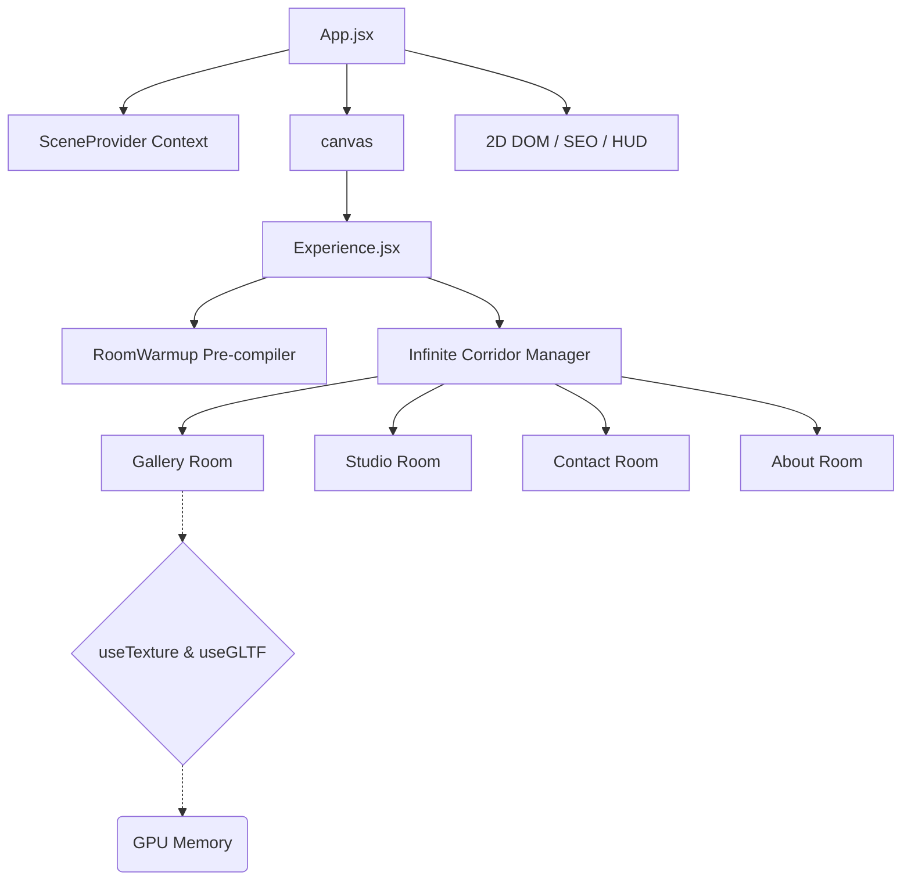

# 🎨 Interactive 3D WebGL Portfolio

<div align="center">
  
  
  
  
  
</div>

<br/>

> [!IMPORTANT]
> **Sourced from [`portfolio-itom`](https://github.com/ITomPoland/portfolio-itom)** — this repository is a **rebuild & republication** of Tomasz "ITom" Szmajda's original portfolio, published here under the **Shaun520** account. Original code & asset copyright stays with the author (see [LICENSE](LICENSE)).

Welcome to the open-source repository of **Tomasz "ITom" Szmajda's** interactive 3D Web Developer portfolio. This project pushes the limits of modern web technologies by blending spatial WebGL computing, complex React ecosystems, and highly optimized frontend engineering.

> [!NOTE]
> Ensure hardware acceleration is enabled in your browser settings to experience the smooth 60 FPS high-tier rendering of this application.

---

## 🎬 Promo Video

https://github.com/user-attachments/assets/af6b388c-8bfe-4bcb-8b81-6dac3aa41221

---

## 🚀 Key Performance Architectures (2026 Standards)

This application is strictly optimized for cross-device operability, achieving zero lag spikes even on mobile processors through several bespoke architectural implementations:

1. **Invisible Semantic SEO Fallback:** Bypasses WebGL canvas SEO limitations via strategic `sr-only-seo` indexing DOM injections, rendering fully visible semantic trees to native search-engine crawlers without mounting heavy bundles.
2. **Asynchronous Shader Compilation:** Enforces `gl.compileAsync` during the Preloading phase inside a hidden `RoomWarmup` Suspense boundary. This allows Three.js to pre-compile complex materials asynchronously without blocking the main React update thread.
3. **Baked Global Tinting & Lighing Extraction:** Replaced real-time WebGL shadow maps and infinite light rays with baked-in global textures (`apply_global_tint.js`), dropping the GPU compute overhead entirely while maintaining visual depth.
4. **DOM Mutation Bypassing:** Critical animation properties (like SVG preloader states tracking 130+ concurrent HTTP texture requests) write directly to the `ref.current.style`, intentionally bypassing React’s `setState` render cycles to conserve CPU.
5. **Adaptive Device Tiering:** Auto-detects `navigator.deviceMemory`, hardware concurrency, and viewport sizes to scale WebGL resolutions (`dpr`), antialiasing algorithms, and texture loading strictness on the fly.

---

## 🏗️ 3D Scene Architecture



---

## 🛠️ Local Development Setup

To run this application natively on your local machine:

1. **Clone the repository:**
   ```bash
   git clone https://github.com/Shaun520/interactive-3d-portfolio.git
   cd interactive-3d-portfolio
   ```

2. **Install dependencies:**
   Make sure you are on Node.js v20+.
   ```bash
   npm install
   ```

3. **Start the local Dev Server:**
   ```bash
   npm run dev
   ```

4. **Other commands:**
   ```bash
   npm run lint    # Run ESLint
   npm run build   # Production build (outputs to dist/)
   npm run preview # Preview the production build locally
   ```

### 🗂️ Sanity Content Studio (`studio/`)
The CMS backend is an npm workspace (`studio/`, same repo). It talks to the same
Sanity project as the frontend. Run it only when you need to edit CMS content:

```bash
npm install
npm run dev --workspace=studio   # Start the Studio UI
```

### ⚠️ Known Dependency Notes
- The **frontend runtime** reports `0` vulnerabilities.
- `npm audit` additionally surfaces **8 advisories** that all come from the **Sanity CLI toolchain**
  (details in `studio/`): `js-yaml`/`smol-toml` (via `@vercel/frameworks`) and `uuid` (via `typeid-js`).
  Fixing them requires `npm audit fix --force`, which downgrades `sanity` to v5 (a breaking change for
  Studio 3). These are build/deploy-time config parsers, **not** on the frontend or content-render
  runtime path, so we keep them as-is and revisit when Sanity publishes a clean 6.x.

### 🔧 Asset Tooling (`scripts/`)
Texture helpers use `sharp`. They are dev-only utilities, not used at runtime:
- `scripts/optimize_*.js` — resize / downscale textures to power-of-two (POT) sizes for WebGL.
- `scripts/fix_*.js` — one-off texture fixups (quality, awards size).
- `scripts/upgrade_contact_quality.js` — specific contact-texture quality pass.

Example: `node scripts/optimize_about.js`

> [!IMPORTANT]
> Since this project heavily utilizes `vite-plugin-compression` and hundreds of high-res textures, your initial local load might take a few seconds as the dev-server buffers asset delivery. For performance testing, always run `npm run build && npm run preview`.

## 🤝 Contributing & Feedback

All PRs improving the shader physics, 3D math logic, or component memoization runtimes are welcome. Please refer to our new `.github` Issue and Pull Request templates when submitting!

1. Fork the Project
2. Create your Feature Branch (`git checkout -b feature/AmazingRoom`)


## License

The code in this repository is licensed under the [MIT License](LICENSE). 
**Note:** All personal assets, 3D textures, images, and copywriting are copyright of Tomasz Szmajda and may not be reused or reproduced without explicit permission.
3. Commit your Changes (`git commit -m 'feat: Added realistic liquid simulation to Contact Room'`)
4. Push to the Branch (`git push origin feature/AmazingRoom`)
5. Open a Pull Request

---

*An interactive 3D WebGL portfolio. Original content © Tomasz "ITom" Szmajda — see [LICENSE](LICENSE).*
